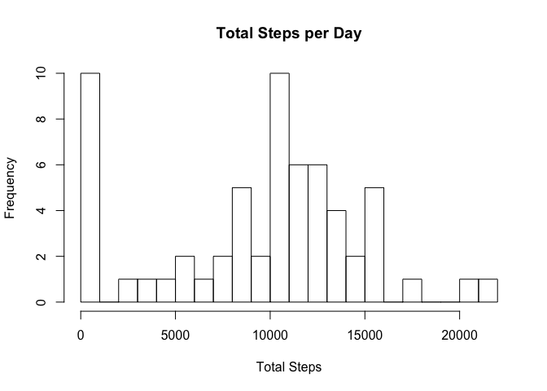
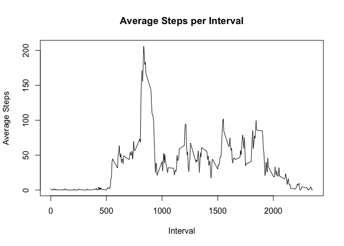
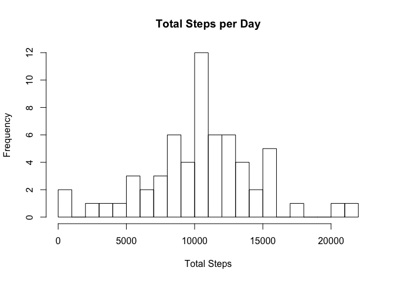
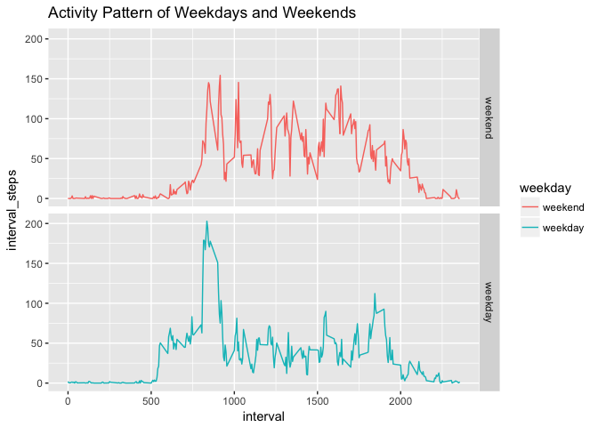

# Reproducible Research: Peer Assessment 1

## Loading and pre-processing the data

Load dplry, lattice, ggplot2, knitr, and mice libraries:

```r
library(dplyr)
library(ggplot2)
library(lattice)
library(knitr)
library(mice)
```

Unzip file to access CSV and read file: 

```r
if(!file.exists("activity.csv")){unzip("activity.zip")}
activity<-read.csv("activity.csv", stringsAsFactors = FALSE, na.strings="NA")
```

## What is mean total number of steps taken per day?  

Group data by date and find mean and median for each day: 

```r
  steps_per_day<-activity %>%
    group_by(date) %>%
    summarise(mean_steps = mean(steps, na.rm = TRUE),
            median_steps = median(steps, na.rm = TRUE))
  kable(steps_per_day)
```


date          mean_steps   median_steps
-----------  -----------  -------------
2012-10-01           NaN             NA
2012-10-02     0.4375000              0
2012-10-03    39.4166667              0
2012-10-04    42.0694444              0
2012-10-05    46.1597222              0
2012-10-06    53.5416667              0
2012-10-07    38.2465278              0
2012-10-08           NaN             NA
2012-10-09    44.4826389              0
2012-10-10    34.3750000              0
2012-10-11    35.7777778              0
2012-10-12    60.3541667              0
2012-10-13    43.1458333              0
2012-10-14    52.4236111              0
2012-10-15    35.2048611              0
2012-10-16    52.3750000              0
2012-10-17    46.7083333              0
2012-10-18    34.9166667              0
2012-10-19    41.0729167              0
2012-10-20    36.0937500              0
2012-10-21    30.6284722              0
2012-10-22    46.7361111              0
2012-10-23    30.9652778              0
2012-10-24    29.0104167              0
2012-10-25     8.6527778              0
2012-10-26    23.5347222              0
2012-10-27    35.1354167              0
2012-10-28    39.7847222              0
2012-10-29    17.4236111              0
2012-10-30    34.0937500              0
2012-10-31    53.5208333              0
2012-11-01           NaN             NA
2012-11-02    36.8055556              0
2012-11-03    36.7048611              0
2012-11-04           NaN             NA
2012-11-05    36.2465278              0
2012-11-06    28.9375000              0
2012-11-07    44.7326389              0
2012-11-08    11.1770833              0
2012-11-09           NaN             NA
2012-11-10           NaN             NA
2012-11-11    43.7777778              0
2012-11-12    37.3784722              0
2012-11-13    25.4722222              0
2012-11-14           NaN             NA
2012-11-15     0.1423611              0
2012-11-16    18.8923611              0
2012-11-17    49.7881944              0
2012-11-18    52.4652778              0
2012-11-19    30.6979167              0
2012-11-20    15.5277778              0
2012-11-21    44.3993056              0
2012-11-22    70.9270833              0
2012-11-23    73.5902778              0
2012-11-24    50.2708333              0
2012-11-25    41.0902778              0
2012-11-26    38.7569444              0
2012-11-27    47.3819444              0
2012-11-28    35.3576389              0
2012-11-29    24.4687500              0
2012-11-30           NaN             NA

Calculate total steps per day and create histogram: 

```r
  by_date<-group_by(activity, date)
  total_steps<-summarise(by_date, daily_steps=sum(steps, na.rm = TRUE))
  hist(total_steps$daily_steps, breaks=30, xlab="Total Steps", main="Total Steps per Day")
```

<!-- -->

## What is the average daily activity pattern?
Group data by interval and find mean for each interval: 

```r
daily_pattern<-activity %>%
  group_by(interval) %>%
  summarise(interval_steps = mean(steps, na.rm = TRUE))
```

Plot average steps taken per interval: 

```r
plot(daily_pattern$interval, daily_pattern$interval_steps, type = "l", xlab="Interval", ylab="Average Steps", main="Average Steps per Interval")
```

<!-- -->

Which 5-minute interval, on average across all the days in the dataset, contains the maximum number of steps?

```r
daily_pattern[which(daily_pattern$interval_steps==max(daily_pattern$interval_steps)),]
```

```
## # A tibble: 1 x 2
##   interval interval_steps
##      <int>          <dbl>
## 1      835       206.1698
```

## Imputing missing values

Find the total number of missing values in the dataset: 


```r
nrow(activity[is.na(activity$steps),])
```

```
## [1] 2304
```

This could also be done using the MICE package: 

```r
md.pattern(activity)
```

```
## Warning in data.matrix(x): NAs introduced by coercion
```

```
##       interval steps  date      
## 15264        1     1     0     1
##  2304        1     0     0     2
##              0  2304 17568 19872
```

Use the MICE package to impute missing values using Predictive Mean Matching: 

```r
imputed_Data <- mice(activity, m=5, maxit = 50, method = 'pmm', seed = 500)
```

Create a new dataset that is equal to the original dataset but with the missing data filled in.

```r
complete_activity<-complete(imputed_Data,3)
```

Make a histogram of the total number of steps taken each day and Calculate and report the mean and median total number of steps taken per day. 


```r
comp_total_steps<-complete_activity%>%
    group_by(date)%>%
    summarise(comp_daily_steps=sum(steps, na.rm = TRUE))
  hist(comp_total_steps$comp_daily_steps, breaks=30, xlab="Total Steps", main="Total Steps per Day")
```

<!-- -->

```r
comp_per_day<-complete_activity %>%
    group_by(date) %>%
    summarise(mean_steps = mean(steps, na.rm = TRUE),
            median_steps = median(steps, na.rm = TRUE))
kable(comp_per_day)
```


date          mean_steps   median_steps
-----------  -----------  -------------
2012-10-01    31.6944444              0
2012-10-02     0.4375000              0
2012-10-03    39.4166667              0
2012-10-04    42.0694444              0
2012-10-05    46.1597222              0
2012-10-06    53.5416667              0
2012-10-07    38.2465278              0
2012-10-08    19.5972222              0
2012-10-09    44.4826389              0
2012-10-10    34.3750000              0
2012-10-11    35.7777778              0
2012-10-12    60.3541667              0
2012-10-13    43.1458333              0
2012-10-14    52.4236111              0
2012-10-15    35.2048611              0
2012-10-16    52.3750000              0
2012-10-17    46.7083333              0
2012-10-18    34.9166667              0
2012-10-19    41.0729167              0
2012-10-20    36.0937500              0
2012-10-21    30.6284722              0
2012-10-22    46.7361111              0
2012-10-23    30.9652778              0
2012-10-24    29.0104167              0
2012-10-25     8.6527778              0
2012-10-26    23.5347222              0
2012-10-27    35.1354167              0
2012-10-28    39.7847222              0
2012-10-29    17.4236111              0
2012-10-30    34.0937500              0
2012-10-31    53.5208333              0
2012-11-01    32.1805556              0
2012-11-02    36.8055556              0
2012-11-03    36.7048611              0
2012-11-04    23.9756944              0
2012-11-05    36.2465278              0
2012-11-06    28.9375000              0
2012-11-07    44.7326389              0
2012-11-08    11.1770833              0
2012-11-09    35.3854167              0
2012-11-10    30.9652778              0
2012-11-11    43.7777778              0
2012-11-12    37.3784722              0
2012-11-13    25.4722222              0
2012-11-14    36.4756944              0
2012-11-15     0.1423611              0
2012-11-16    18.8923611              0
2012-11-17    49.7881944              0
2012-11-18    52.4652778              0
2012-11-19    30.6979167              0
2012-11-20    15.5277778              0
2012-11-21    44.3993056              0
2012-11-22    70.9270833              0
2012-11-23    73.5902778              0
2012-11-24    50.2708333              0
2012-11-25    41.0902778              0
2012-11-26    38.7569444              0
2012-11-27    47.3819444              0
2012-11-28    35.3576389              0
2012-11-29    24.4687500              0
2012-11-30    26.5729167              0

## Are there differences in activity patterns between weekdays and weekends?

Create a new factor variable in the dataset with two levels – “weekday” and “weekend” indicating whether a given date is a weekday or weekend day.


```r
complete_activity<-mutate(.data = complete_activity, date=as.Date(date))
weekdays <- c('Monday', 'Tuesday', 'Wednesday', 'Thursday', 'Friday')
complete_activity$weekday <- factor((weekdays(complete_activity$date) %in% weekdays), 
         levels=c(FALSE, TRUE), labels=c('weekend', 'weekday'))
```

Make a panel plot containing a time series plot (i.e. 𝚝𝚢𝚙𝚎 = "𝚕") of the 5-minute interval (x-axis) and the average number of steps taken, averaged across all weekday days or weekend days (y-axis). 


```r
weekday_pattern<-complete_activity %>%
  group_by(weekday, interval) %>%
  summarise(interval_steps = mean(steps, na.rm = TRUE))

ggplot(weekday_pattern, aes(x=interval, y=interval_steps, group=weekday, col=weekday)) +
  geom_line() + 
  facet_grid(weekday~.) +
  ggtitle("Activity Pattern of Weekdays and Weekends")
```

<!-- -->
